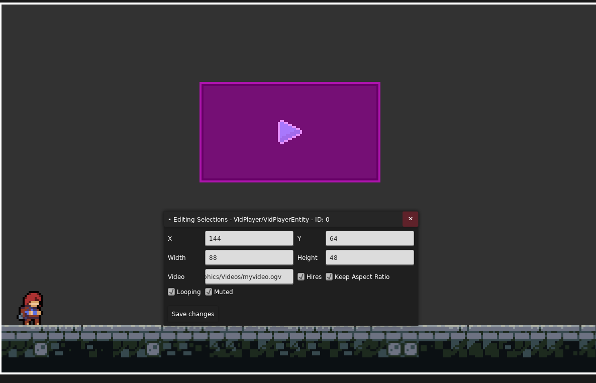

# VidPlayer
A simple Celeste mod to play videos in game.

## Usage
### Requirements
It currently only supports videos in the OGV format. Consequently you will have to 
transcode your videos to this format, with ffmpeg you simply can do:
```bash
ffmpeg -i input-file.mp4 -codec:v libtheora -qscale:v 7 -codec:a libvorbis -qscale:a 5 output-file.ogv
```
to transcode an MP4 video to a OGV one.

Other tools may be able to achieve the same result.

### With Lönn
Simply pass your video file to the "In-Game Video Player" entity.


### With LuaCutscenes
It is also possible to play videos programatically through LuaCutscenes:
```lua
local vidPlayer = require("#Celeste.Mod.VidPlayerEntityLua")
local v
function onBegin()
    v = vidPlayer.SpawnLoop("TestMod:/Graphics/Videos/myvideo.ogv", 10, 10, 100, 100)
    wait(10)
    v:RemoveSelf()
end

function onEnd()
    v:RemoveSelf()
end
```
See [here](Docs/api/Celeste.Mod.VidPlayer.VidPlayerEntityLua.md)
for the full documentation.

### As a styleground
You can also set it as a styleground in loenn, hires will be forcefully disabled for now and looping enabled.
Its recommended that your video's resolutions is already 320x180 to prevent downscaling artifacts.

## Extra
Playing the same video file in two players is not supported.

Savestates are safe and won't crash the game, but no further support for those is implemented.
